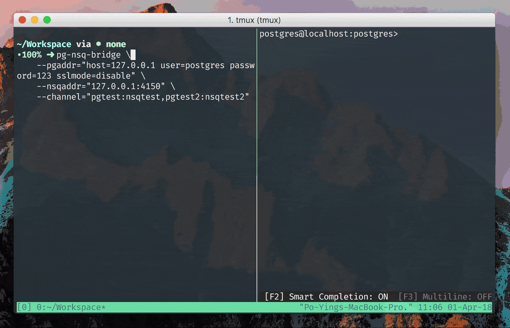

# pg-nsq-bridge

Publish messages from Postgres to NSQ



### Usage

```bash
$ pg-nsq-bridge \
    --pgaddr="host=127.0.0.1 user=postgres password=123 sslmode=disable" \
    --nsqaddr="127.0.0.1:4150" \
    --channel="pgtest:nsqtest,pgtest2:nsqtest2"o
```

### Install

```bash
$ git clone git@github.com:poying/pg-nsq-bridge.git
$ cd pg-nsq-bridge
$ make install
```